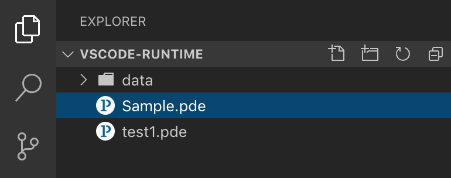
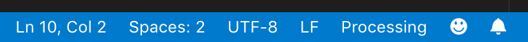
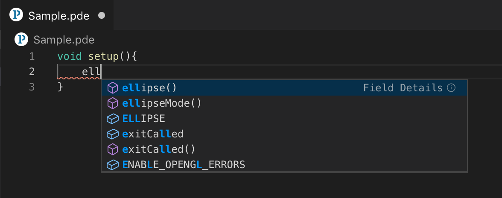
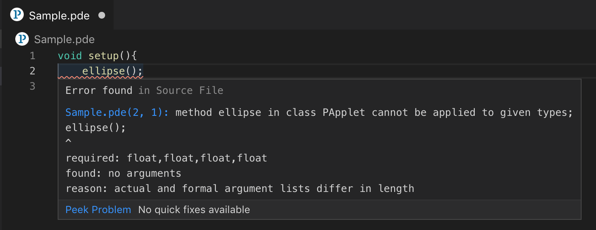
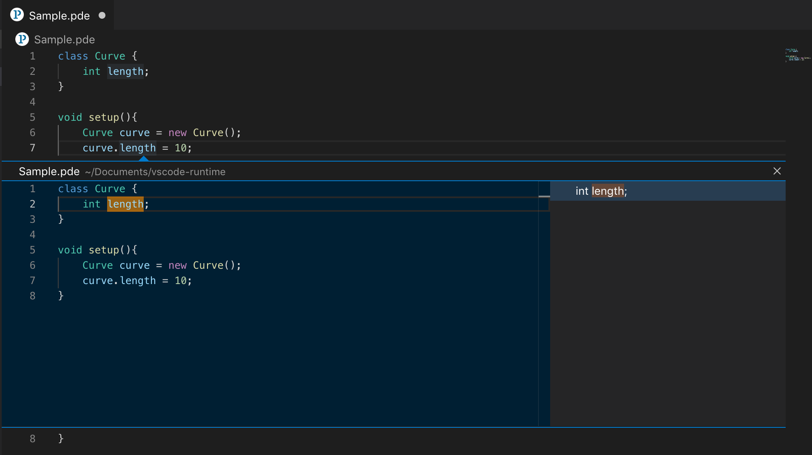
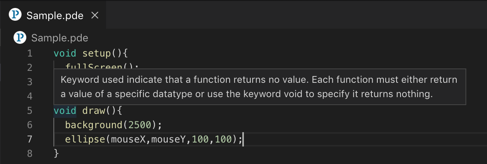
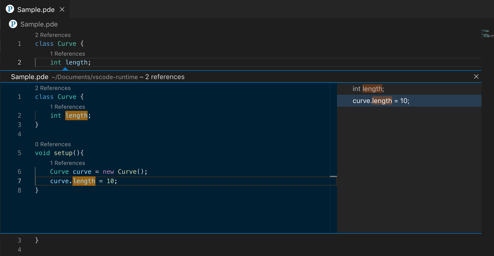
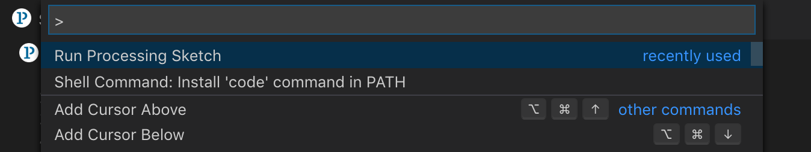
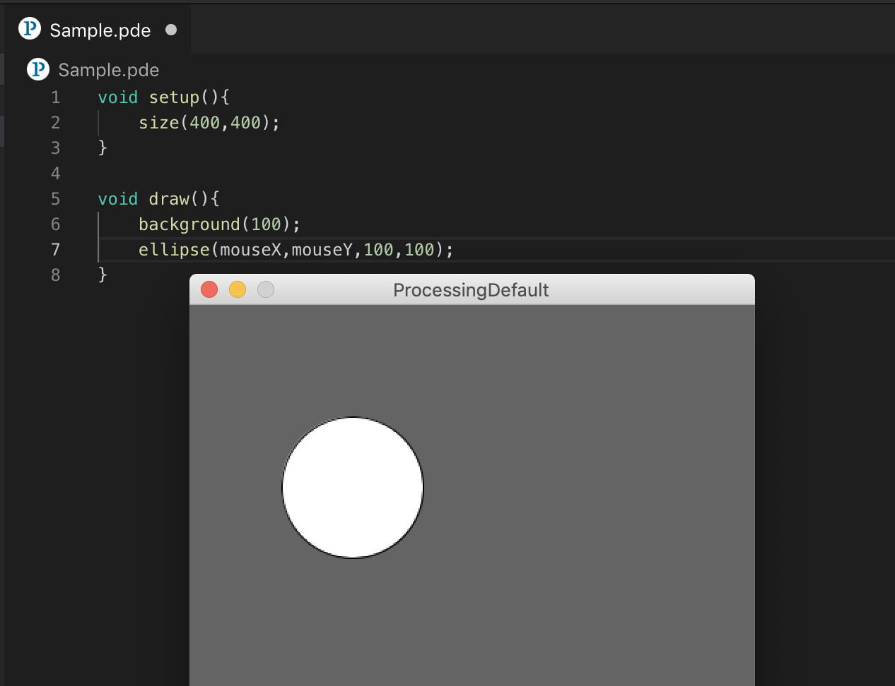

# Processing Language Server

   

> What's Processing Language Server

<b>Processing Language Server</b> is a [Language Server Protocol (LSP)](https://microsoft.github.io/language-server-protocol/) implementation for Processing Programming Language. All the language specific features of Processing can now be extended to most the generic editors like VSCode, Atom, Sublime text and so on, by extending this Language Server. LS4P contains both Processing Language Server and a VSCode client. Refer [SETUP.md](https://github.com/processing-language-server/LS4P/blob/master/assets/SETUP.md) to setup Processing Language Server locally and [NEWCLIENT.md](https://github.com/processing-language-server/LS4P/blob/master/assets/NEWCLIENT.md) to create your own Processing Language Client. 

* <b>Pre-note:</b> 
	- Save the sketch with the extension <b>.pde</b> to initiate the Processing Language Server. 
	

        
    

* <b>Activation Event:</b> 
	- <b>Processing</b> should appear in the status bar of vscode indicating Processing Language Server is active. 
	

        
    

## Current Capabilities of LS4P

* <b>Auto-completion:</b>
	- Gives you context-aware suggestions to help you code faster. 
	- Autocompletion will function as you enter your code in the workspace and can be explicitly triggered using the character `.` after an instance of a class. 
	

        
    

* <b>Diagnostics:</b>
	- Automatically detects the errors in your code in real-time.
	- Represented using squiggly lines.
	- Hover over the word that has squiggly lines to find out the cause of the error. 
	

        
    

* <b>Go-to definition:</b>
	- `cmd+click` on a variable, will move the cursor to the variable declaration.
	- This also works for method and class declarations
	- An alternate way of invocation: right-click on the variable name and click <b>Go to Definition</b>. 
	

		
    

* <b>Hover Insights:</b>
	- Hover mouse pointer over a keyword - this brings up a pop-up containing what that keyword means. 
	

        
    

* <b>Finding References:</b>
	- Helps you find all the references of a variable, class or a function used. 
	- Can be invoked by clicking on the <b>n References</b> link that appears over all the Variable, Class or Method Declarations.
	- An alternate way of invocation: Right-click on a Variable, Class or Method name and click <b>Peek References</b>. 
	

		
    

* <b>Running sketch:</b>
	- `cmd+shift+P` to bring up the run console and type Run Processing sketch, press enter - runs the processing sketch. 
	

         
		
    
